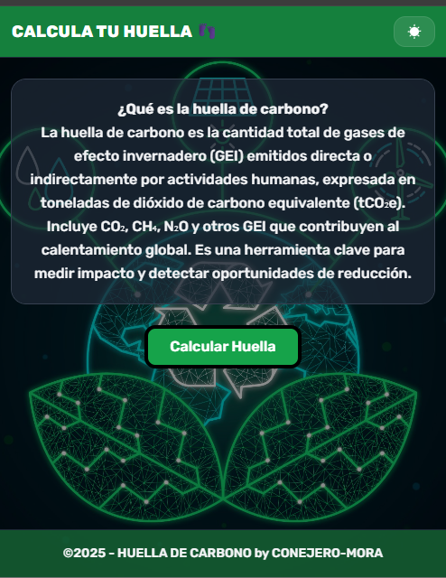
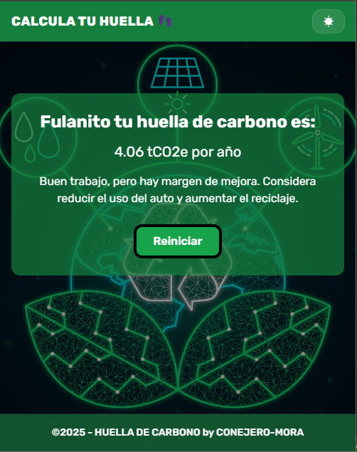

# 🌍 Calculadora de Huella de Carbono

## 📌 Descripción  
Este proyecto es una **calculadora interactiva de huella de carbono** desarrollada con **HTML, CSS y JavaScript**.  
Permite al usuario ingresar datos sobre su estilo de vida (vivienda, transporte, alimentación, consumo de energía, etc.) y calcular automáticamente su impacto ambiental estimado en toneladas de CO₂ equivalentes por año (**tCO₂e/año**).  

Incluye:  
- Un formulario paso a paso con validaciones.  
- Modo **claro/oscuro** con preferencia guardada en `localStorage`.  
- Mensajes personalizados según el resultado.  

---

## ⚙️ Tecnologías utilizadas  
- **HTML5** → estructura del formulario.  
- **CSS3** (custom + Tailwind) → estilos, fondo y overlay dinámico.  
- **JavaScript (Vanilla)** → lógica del formulario, validación, cálculo de huella de carbono y modo oscuro.  

---

## 📂 Estructura del proyecto  
```bash
.
├── index.html          # Página principal con formulario
├── estilos.css         # Estilos personalizados + fondo y overlay
├── script.js           # Lógica del cuestionario y cálculo de huella
├── script2.js          # Configuración de tema (claro/oscuro)
└── imagenes/           # Carpeta con imágenes y capturas
    ├── imagen de fondo.jpg
    ├── Inicio.png
    └── Resultado.png
````

---

## ▶️ Cómo ejecutar el proyecto

1. Clonar el repositorio o descargar los archivos.

   ```bash
   git clone https://github.com/euge1982/Conejero-Mora-tpIntegrador.git
   ```
2. Abrir `index.html` en cualquier navegador moderno (Chrome, Firefox, Edge).
3. Interactuar con el formulario paso a paso y obtener el cálculo final.

👉 **No requiere instalación adicional** (solo navegador).

---

## 📸 Capturas de pantalla

### Pantalla inicial



### Resultado final



---

## 💻 Fragmentos de código destacados

### 1. Cálculo de la huella de carbono

Este bloque suma diferentes factores de consumo y los convierte a toneladas de CO₂ equivalente por año:

```js
function calcularHuellaCarbono(respuestas) {
  let huellaTotal = 0;

  // Ejemplo: transporte en auto
  const tipoAuto = respuestas["auto"];
  const kmAuto = parseFloat(respuestas["kmAuto"]) || 0;
  switch (tipoAuto) {
    case "Nafta": huellaTotal += kmAuto * 0.2; break;
    case "Gasoil": huellaTotal += kmAuto * 0.18; break;
    case "Electrico": huellaTotal += kmAuto * 0.05; break;
  }

  // Conversión a toneladas anuales
  huellaTotal = huellaTotal / 1000 * 52;
  return huellaTotal;
}
```

👉 Se pondera cada categoría (vivienda, transporte, viajes, alimentación, energía, residuos, etc.) y al final se convierte el total en **tCO₂e/año**.

---

### 2. Validación de inputs antes de avanzar

Cada sección del formulario valida que el usuario complete los campos antes de permitir avanzar:

```js
const inputs = currentSection.querySelectorAll("input, select");
let valido = true;

inputs.forEach(input => {
  if ((input.type === "text" || input.type === "number") && input.value.trim() === "") {
    valido = false;
    input.classList.add("border-red-500");
  } else if (input.tagName === "SELECT" && input.value.trim() === "") {
    valido = false;
    input.classList.add("border-red-500");
  } else {
    input.classList.remove("border-red-500");
  }
});
```

👉 Esto evita que se salten pasos sin completar datos obligatorios.

---

### 3. Modo claro/oscuro con `localStorage`

El modo oscuro se aplica automáticamente según la preferencia del usuario y se guarda en el navegador:

```js
btnToggle.addEventListener('click', () => {
  const root = document.documentElement;
  const isDark = root.classList.toggle('dark');
  localStorage.setItem('theme', isDark ? 'dark' : 'light');
  if (label) label.textContent = isDark ? 'Claro' : 'Oscuro';
});
```

👉 Permite personalizar la interfaz sin perder la configuración al recargar la página.

---

## 👥 Autores

* **Eugenia Mora** – Desarrolladora del proyecto
* **Jessica Conejero** – Desarrolladora del proyecto

---

## 📜 Licencia

Este proyecto se distribuye bajo la licencia MIT.
Eres libre de usarlo, modificarlo y compartirlo citando la autoría.
